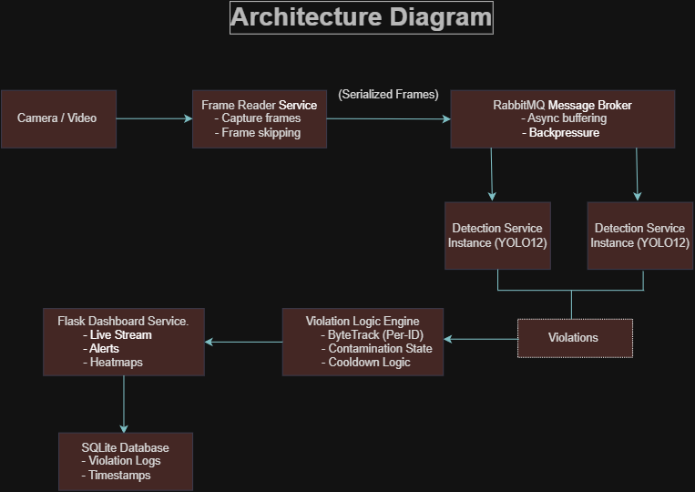
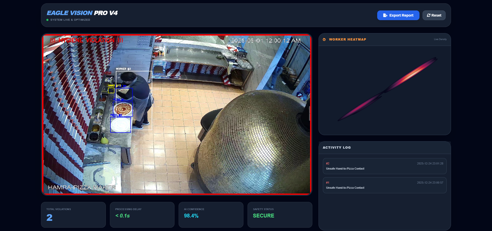

# Technical Documentation: Pizza Store Hygiene Monitoring System

## 1. System Architecture Overview

The Pizza Store Hygiene Monitoring System is implemented using a microservices architecture to ensure modularity, scalability, and fault isolation. Each service is responsible for a specific domain of functionality, allowing independent development, deployment, and scaling. Communication between services is handled asynchronously through RabbitMQ.

### Core Services

1. **Frame Reader Service**

   - Captures and preprocesses video frames from cameras or video files
   - Applies optional frame skipping for performance optimization
   - Serializes frames and publishes to RabbitMQ

2. **Message Broker (RabbitMQ)**

   - Acts as the communication hub between services
   - Buffers frames for asynchronous processing
   - Ensures reliable delivery of frames and processed results
   - Justification: Handles high FPS streams without dropping frames

3. **Detection & Violation Service**

   - Consumes frames from RabbitMQ
   - Performs object detection with YOLO12 (Hands, Scoopers, Protein, Pizza)
   - Tracks hands using ByteTrack for persistent per-ID tracking
   - Applies contamination state logic:
     - Hand enters Protein ROI without scooper → marked contaminated
     - Dynamic pizza ROI calculated per frame
   - Applies 15-second cooldown to prevent duplicate violation logging
   - Publishes violation results to dashboard service

4. **Streaming Dashboard & Persistence**
   - Flask-based web dashboard for real-time monitoring
   - Displays video stream with bounding boxes, ROIs, and violation alerts
   - Logs violations in SQLite with timestamps, hand IDs, and frame info
   - Generates analytics, heatmaps, and historical records

### Architecture Visuals



> High-level diagram showing asynchronous frame processing, multiple detection workers, per-ID violation logic, and real-time monitoring.



> Web dashboard showing annotated video streams, real-time alerts, and historical analytics.

---

## 2. Computer Vision Pipeline

### Object Detection

- YOLO12 (Ultralytics) used for real-time detection
- Produces bounding boxes and confidence scores
- Detects: Hands, Scoopers, Protein ingredients, Pizza dough

### Object Tracking

- ByteTrack used to assign persistent IDs to hands across frames
- Enables per-ID contamination tracking and cooldown logic
- Handles occlusions, fast hand movements, and multiple workers simultaneously

### ROI Analysis

- Protein ROI: Marks sensitive ingredient area
- Pizza ROI: Dynamically calculated per frame from pizza detection
- Allows accurate detection of hand interactions with ingredients and dough

---

## 3. Advanced Logic and Edge Case Handling

### Per-Hand Contamination State

- Each tracked hand has a boolean contamination flag
- Logic:
  1. Hand enters Protein ROI without scooper → contaminated
  2. Contaminated hand approaches Pizza ROI → violation logged
  3. Cooldown prevents duplicate alerts for 15 seconds per hand ID

```python
if (current_time - last_recorded_time) > COOLDOWN_SECONDS:
    violation = True
    violation_tracker[hand_id] = current_time
```

### Edge Cases Handled

- Hand enters ROI but does not pick ingredient (e.g., cleaning) → no violation
- Multiple workers interacting with the same pizza simultaneously → each hand tracked independently via ByteTrack
- Frame skipping ensures system handles high FPS without dropping critical detections

### Temporal Filtering

- Violations only logged if cooldown expired to avoid redundant alerts
- Preserves alert quality while reducing noise

---

## 4. Data Persistence

### SQLite Database Schema

```sql
CREATE TABLE violations (
    id INTEGER PRIMARY KEY AUTOINCREMENT,
    frame_id INTEGER,
    hand_id INTEGER,
    violation_type TEXT,
    timestamp DATETIME,
    image_path TEXT
);
```

Logs violations with frame ID, hand ID, type, timestamp, and path to annotated frame. Supports auditing and historical analysis.

---

## 5. Installation & Deployment

### Docker (Recommended)

```bash
docker-compose up --build
```

Starts RabbitMQ, Detection Service, Frame Reader Service, Dashboard Service.

### Local Development Setup

```bash
git clone <repository-url>
cd pizza-scooper-violation

python -m venv venv
venv\Scripts\activate     # Windows

pip install -r requirements.txt
```

Start services manually:

```bash
# RabbitMQ
.\rabbitmq-service.bat start
.\rabbitmq-plugins.bat enable rabbitmq_management

# Detection Service
python detection_service/main.py

# Dashboard
python streaming_service/app.py

# Frame Reader
python frame_reader_service/reader.py
```

Access dashboard: http://localhost:5000

---

## 7. Key Features

- Real-time video processing
- Per-ID contamination tracking
- Dynamic ROIs
- Smart cooldown mechanism
- Parallel scalable detection services
- Persistent violation logging
- Heatmaps and analytics
- Production-ready Docker deployment

---

## Notes

Designed for crowded kitchens, high FPS streams, occlusions, and rapid hand movements. The architecture and logic can be extended to other hygiene or compliance monitoring applications.

---

## Image Assets Location

Place images in the `assets` folder at the project root:

```
pizza-scooper-violation/
│
├── assets/
│   ├── architecture.png
│   └── dashboard.png
├── README.md
├── TECHNICAL_DOCUMENTATION.md
├── detection_service/
├── streaming_service/
├── frame_reader_service/
└── requirements.txt
```
